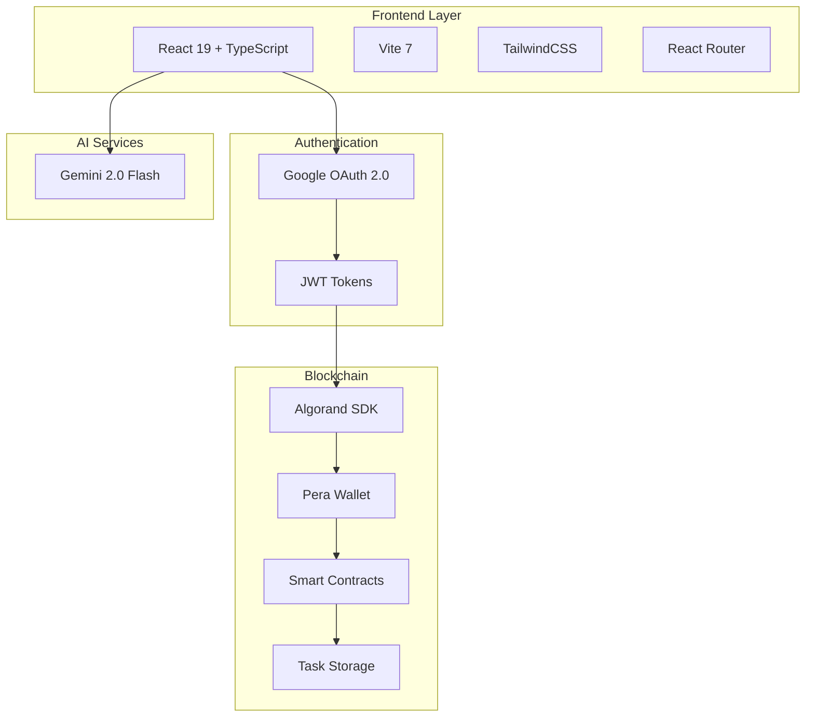
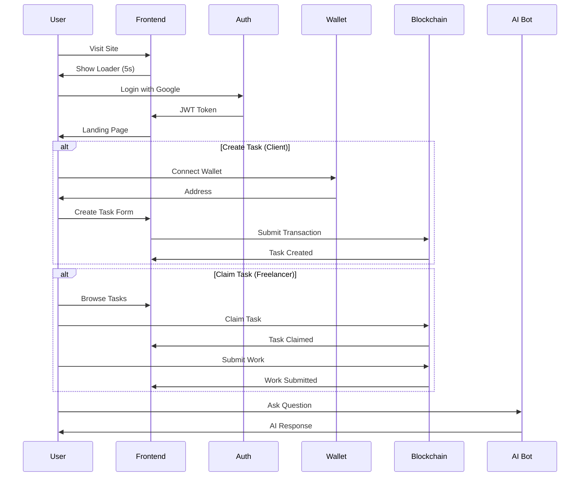
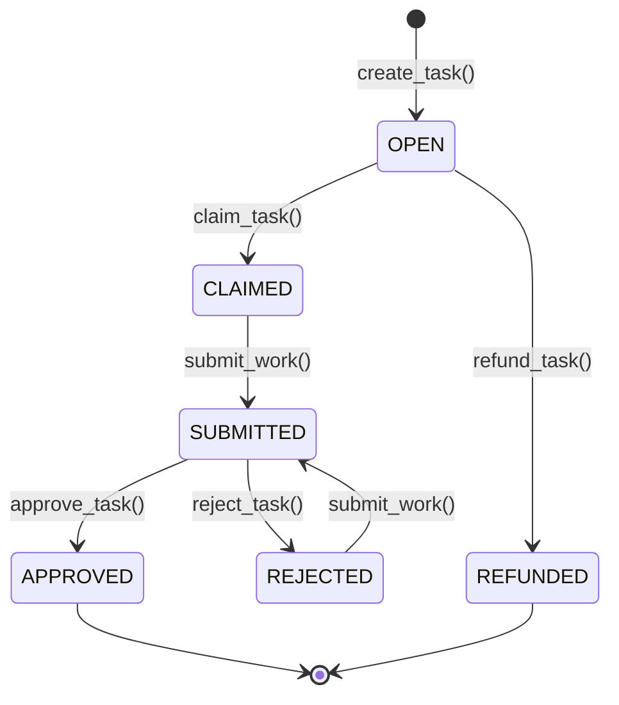
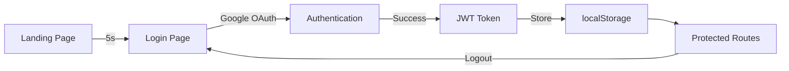
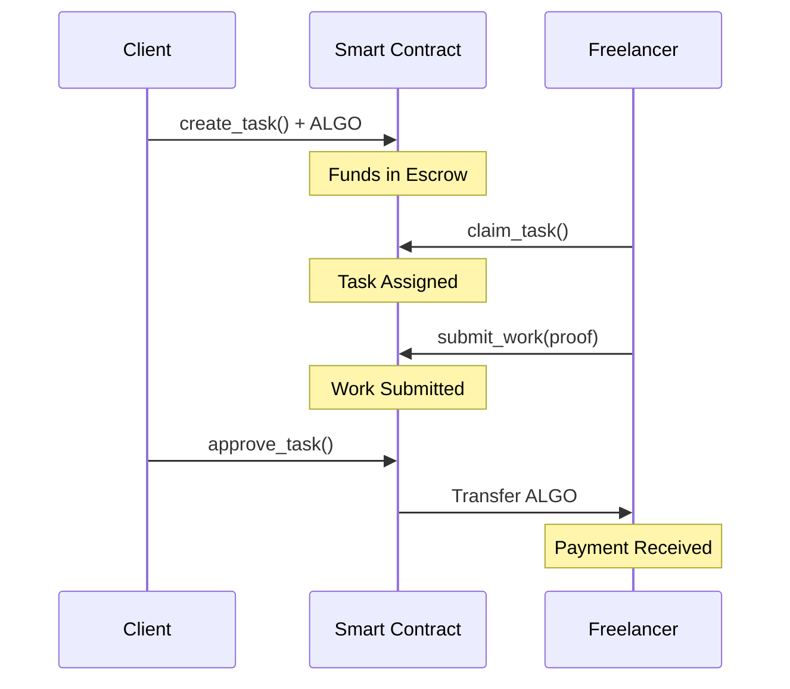
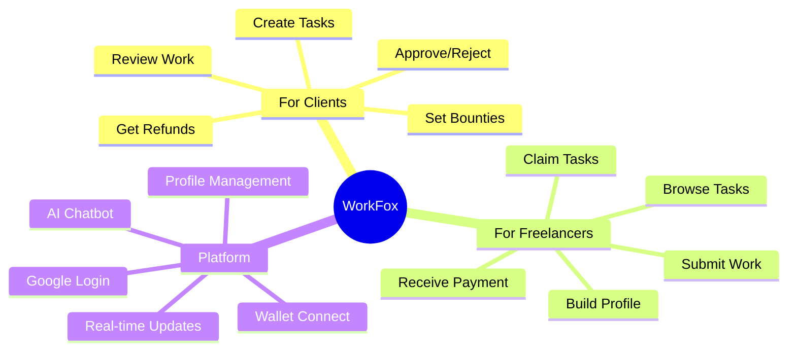
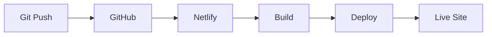
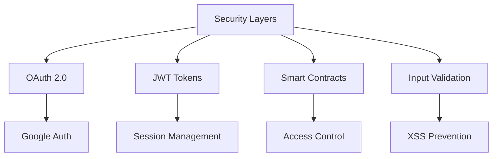
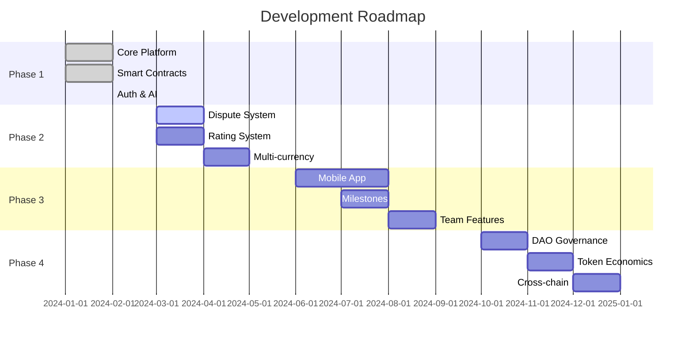
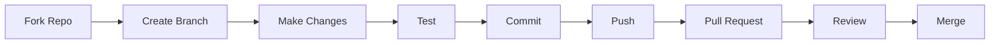

# WorkFox 🦊

> Decentralized Freelance Platform on Algorand Blockchain

[](https://workfox.netlify.app)
[](https://nodejs.org)
[](LICENSE)

**🌐 Live:** [workfox.netlify.app](https://workfox.netlify.app)

---

## 🏛️ System Architecture



---

## 🔄 Application Flow



---

## 🏗️ Project Structure

```
WorkFoxx_Novasphere/
│
├── 📁 public/
│   ├── images/logo.png
│   └── _redirects
│
├── 📁 src/
│   ├── 📁 components/
│   │   ├── AIChatbot.tsx       # 🤖 AI Assistant
│   │   ├── Header.tsx          # 🧭 Navigation
│   │   ├── Footer.tsx          # 📄 Footer
│   │   ├── LoadingScreen.tsx   # ⏳ Loader
│   │   └── TaskCard.tsx        # 📋 Task Display
│   │
│   ├── 📁 contexts/
│   │   └── AuthContext.tsx     # 🔐 Auth State
│   │
│   ├── 📁 pages/
│   │   ├── LandingPage.tsx     # 🏠 Home
│   │   ├── Login.tsx           # 🔑 Auth
│   │   ├── TaskBoard.tsx       # 👨‍💻 For Freelancers
│   │   ├── CreateTask.tsx      # 💼 For Clients
│   │   ├── Dashboard.tsx       # 📊 User Dashboard
│   │   ├── Profile.tsx         # 👤 User Profile
│   │   ├── Developers.tsx      # 🛠️ Dev Docs
│   │   └── AboutUs.tsx         # ℹ️ About
│   │
│   ├── frontend-integration.ts # ⛓️ Blockchain
│   ├── WalletProvider.tsx      # 👛 Wallet
│   └── App.tsx                 # 🎯 Root
│
├── .env.example
├── netlify.toml
└── package.json
```

---

## 🎯 Smart Contract Flow



### Task States

| State | Code | Description |
|-------|------|-------------|
| 🟢 OPEN | 0 | Available for claiming |
| 🔵 CLAIMED | 1 | Assigned to freelancer |
| 🟡 SUBMITTED | 2 | Work submitted |
| 🟣 APPROVED | 3 | Payment released |
| 🔴 REJECTED | 4 | Work rejected |
| ⚪ REFUNDED | 5 | Funds returned |

---

## 🚀 Quick Start

### 1️⃣ Clone & Install

```bash
git clone https://github.com/Naren1520/WorkFoxx_Novasphere.git
cd WorkFoxx_Novasphere
npm install
```

### 2️⃣ Configure

```bash
cp .env.example .env
# Add your keys:
# VITE_GEMINI_API_KEY=your_key
# VITE_GOOGLE_CLIENT_ID=your_client_id
```

### 3️⃣ Run

```bash
npm run dev
# Open http://localhost:5173
```

---

## 🔐 Authentication Flow



---

## 💳 Payment Flow



---

## 🛠️ Tech Stack

<table>
<tr>
<td width="50%">

### Frontend
- ⚛️ React 19
- 📘 TypeScript
- ⚡ Vite 7
- 🎨 TailwindCSS
- 🧭 React Router

</td>
<td width="50%">

### Backend/Services
- ⛓️ Algorand Blockchain
- 👛 Pera Wallet
- 🔐 Google OAuth
- 🤖 Gemini 2.0 AI
- 🚀 Netlify

</td>
</tr>
</table>

---

## 🗺️ Features Map



---

## 🔧 Configuration

### Google OAuth

```
Console: console.cloud.google.com/apis/credentials

JavaScript Origins:
├── http://localhost:5173
└── https://workfox.netlify.app

Redirect URIs:
├── http://localhost:5173
├── http://localhost:5173/login
├── https://workfox.netlify.app
└── https://workfox.netlify.app/login
```

### Gemini API

```
Get Key: aistudio.google.com/app/apikey
Add to: .env → VITE_GEMINI_API_KEY
```

---

## 📊 Data Models

### User Profile
```typescript
{
  name: string
  email: string
  phone: string
  address: string
  role: 'freelancer' | 'client' | 'both'
  bio: string
}
```

### Task
```typescript
{
  taskId: number
  client: string
  freelancer: string
  amount: bigint
  deadline: bigint
  status: 0-5
  title: string
  description: string
  proofHash: string
}
```

---

## 🚢 Deployment



### Build Config
```toml
[build]
  command = "rm -rf node_modules package-lock.json && npm install && npm run build"
  publish = "dist"

[build.environment]
  NODE_VERSION = "20"
```

---

## 📈 Performance

| Metric | Target | Status |
|--------|--------|--------|
| First Paint | < 1.5s | ✅ |
| Interactive | < 3.5s | ✅ |
| Lighthouse | > 90 | ✅ |
| Bundle Size | < 500KB | ✅ |

---

## 🔒 Security



---

## 🗺️ Roadmap



---

## 🤝 Contributing



See [CONTRIBUTING.md](CONTRIBUTING.md) for details.

---

## 📞 Support

<table>
<tr>
<td align="center">

<br><b>GitHub</b>
<br><a href="https://github.com/Naren1520/WorkFoxx_Novasphere/issues">Issues</a>
</td>
<td align="center">

<br><b>Discord</b>
<br><a href="#">Community</a>
</td>
<td align="center">

<br><b>Email</b>
<br><a href="mailto:support@workfox.app">Support</a>
</td>
</tr>
</table>

---

## 📄 License

MIT License - see [LICENSE](LICENSE)

---

## 🙏 Built With

<p align="center">


</p>

---

<p align="center">
<b>Built with ❤️ on Algorand</b>
<br>
<sub>Decentralizing the Future of Work</sub>
</p>
